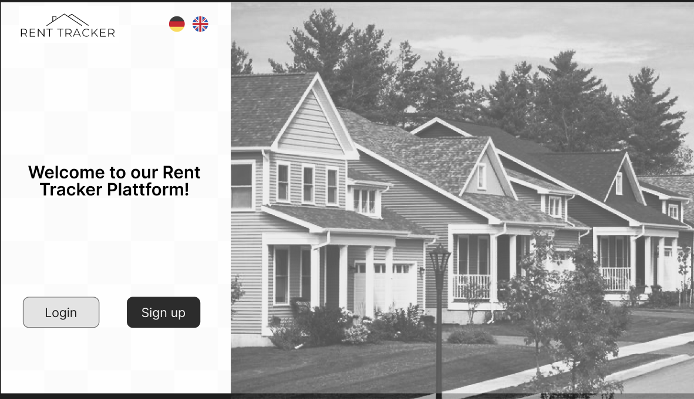
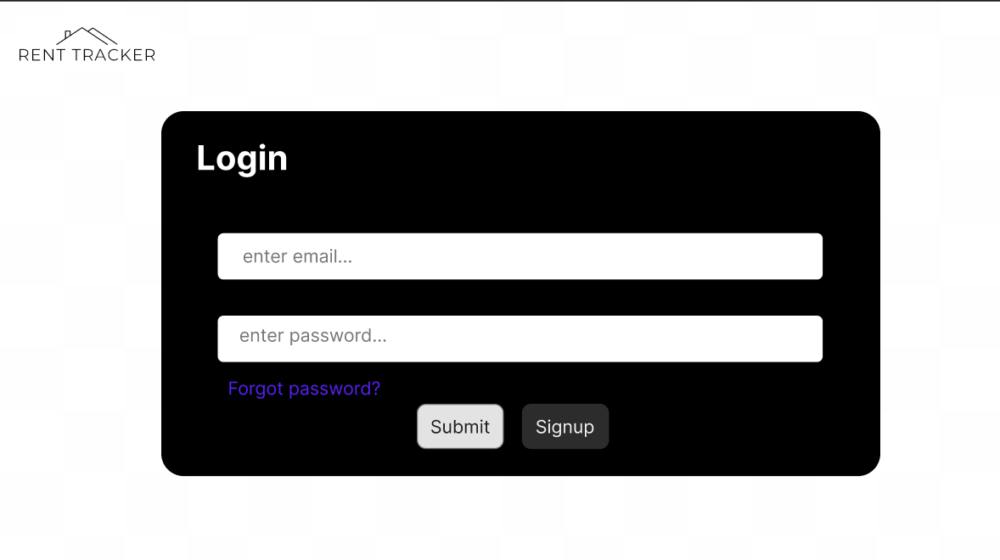
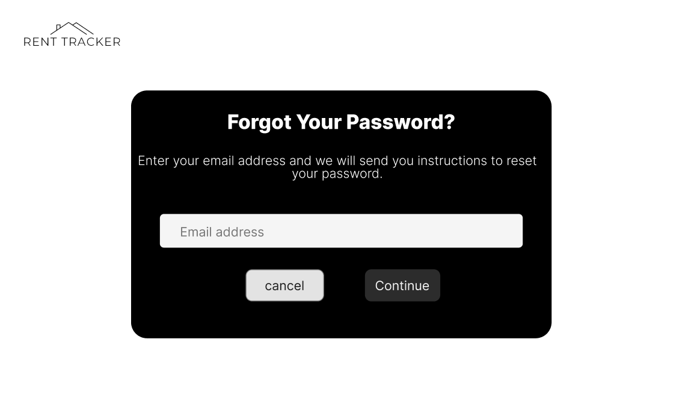
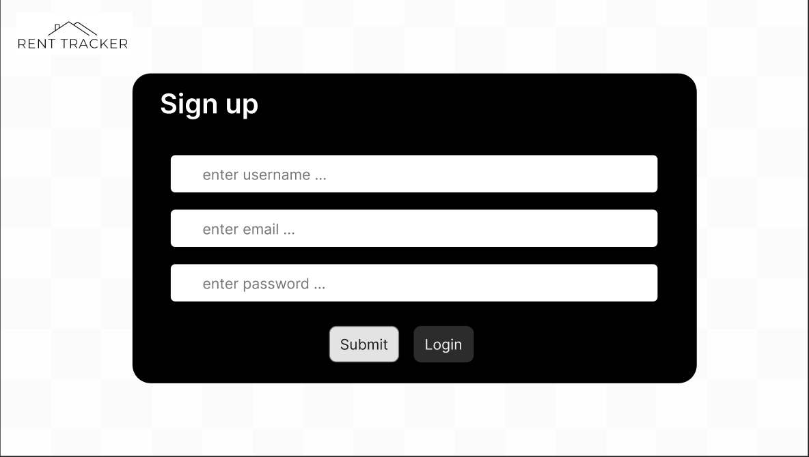
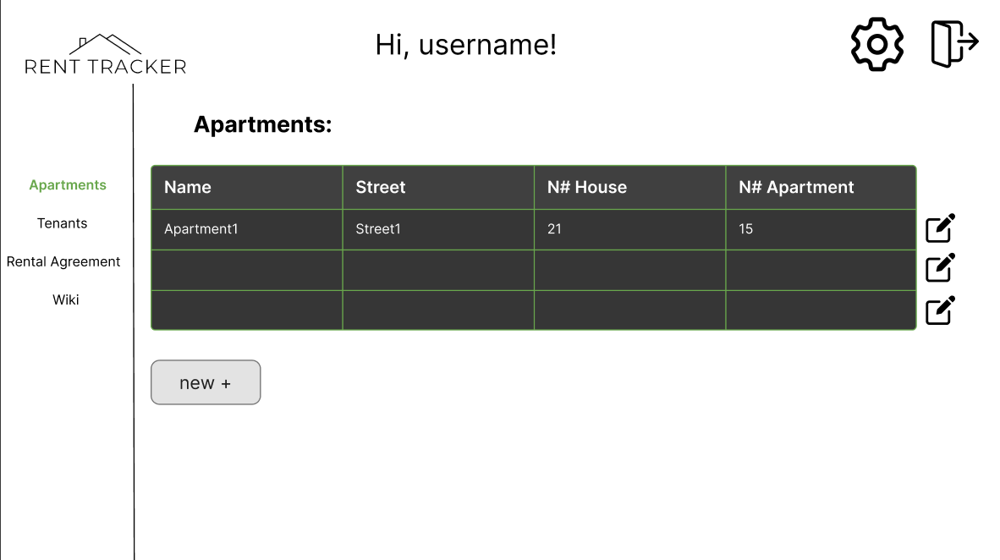
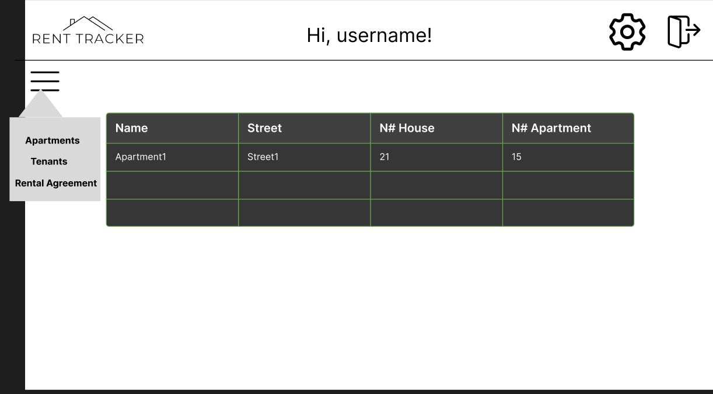
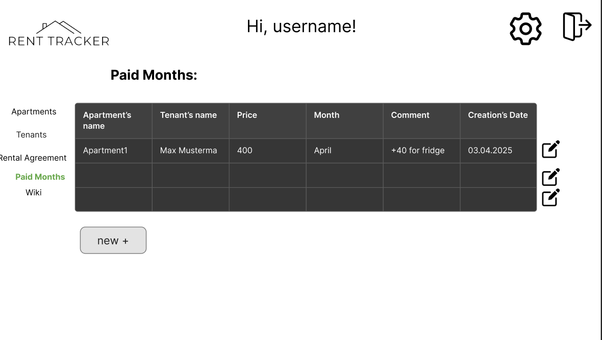
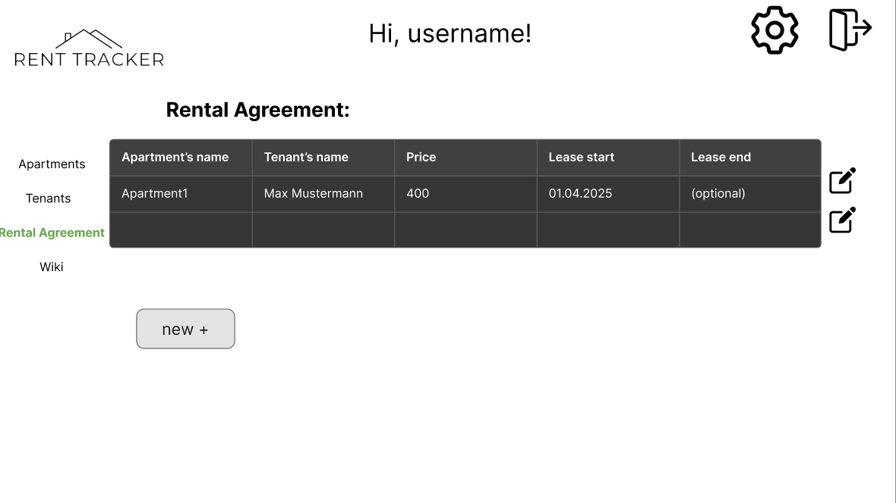
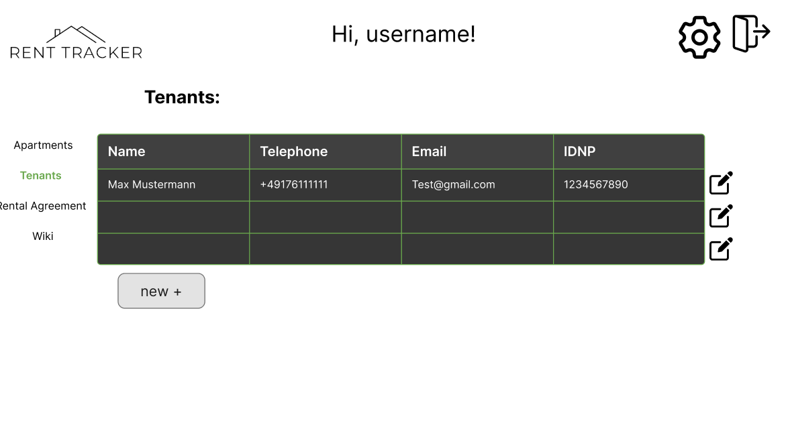

{: .label }
[Caren Kedis]

# Design Documentation
Our design journey began with simple paper sketches. With pen and paper, our team quickly captured initial ideas and layouts for the application. These early sketches helped us understand the overall look and feel and served as the foundation for our digital designs.

Once we had a clear idea, we moved our work to Figma to develop more refined drafts. The following images showcase our first digital sketches and iterations:

## Figma Drafts

This document will continue to evolve as our design matures through further iterations and feedback.