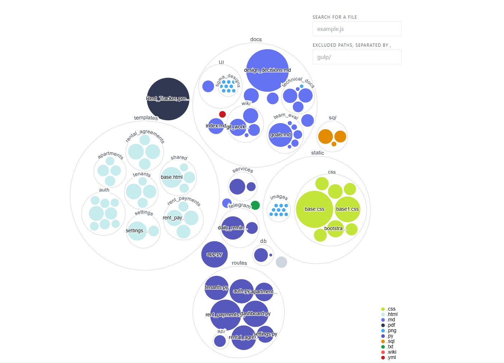

{: .label }
Denis Cercasin

{: .no_toc }
# Architecture

{: .text-delta }

Table of contents

+ ToC
{: toc }

## Overview

Rent Tracker is a lightweight web-based tool that helps property owners and managers track rent payments, manage tenants, and automate reminders via Telegram.

The system supports:
- Managing apartments, tenants, and rental agreements
- Logging rent payments and tracking unpaid months
- Automatically sending monthly reminders
- User registration via Telegram bot
- Email support via SendGrid
- Clean UI using **Jinja2 templates and Bootstrap

The app is designed using Flask + SQLite, with modular Blueprints, WTForms for forms, and a custom ORM layer. Telegram integrations run in separate services.

---

## Codemap

Thanks to [repo-visualizer](https://github.com/githubocto/repo-visualizer), we generated the following bird’s-eye view of the codebase.  
It helps contributors quickly understand the structure and relative size of different modules and files:

Here’s how the project is structured:
- app
  - routes
    - auth.py #Login, registration, password reset
    - apartments.py #Apartment CRUD
    - tenants.py #Tenant CRUD
    - rental_agreements.py #Assignment of tenants to apartments (with dates)
    - rent_payments.py #Tracking rent status
    - settings.py #Telegram connection, profile settings
    - dashboard.py #Main screen with all financial data
    - api/ #API for fetching all data about unpaid rents
  - templates/ # Jinja2 templates (base.html, modular views)
  - static/ # CSS, Bootstrap, images
  - services/ #Helper functions
  - telegram/ #Telegram bots for registration and sending reminders
    - daily_reminder/ #Reminder script (can run via cron/GitHub Actions)
  - db/ # SQLite init and ORM helpers
  - forms/ #Used for WTForms integration
  - docs/ #Full documentation hosted on Github Pages
  - models/ #User data model for SQLAlchemy integration
  - sql/ #Manipulating the data in the database
  - LICENSE
  - README.md
  - requirements.txt
  - app.py # Main Flask app

💡 Additional Diagrams available at: [`docs/design_decisions.md`](../design_decisions.md)

---

## Cross-Cutting Concerns

### Authentication & User Management
- Built using Flask-Login
- Passwords are hashed
- WTForms used for form validation

### Rental Logic
- One tenant per rental agreement at a time per apartment
- Each agreement has start_date and optional end_date
- Gaps between tenants are allowed and correctly handled in reminders

### Reminders via Telegram
- `services/daily_reminder.py`: checks daily for unpaid months
- Runs manually or via cron / GitHub Actions
- Skips months with no active tenant

### Telegram Bot for User Setup
- `services/telegram/bot.py`: allows users to connect their Telegram account via `/start`
- Uses polling locally; designed to switch to webhook in production

### Email Notifications
- Powered by SendGrid
- Used for password reset flow

---

## Data Model

We maintain a normalized relational structure with:
- `users`
- `apartments`
- `tenants`
- `rental_agreements`
- `rent_payments`
  
See full diagram & explanation: [`docs/data_model.md`](./data_model.md)

---

## External Integrations

| Service       | Purpose                          | Status       |
|---------------|----------------------------------|--------------|
| Telegram Bot  | Rent reminders & registration    | ✅ (manual, not hosted)  |
| SendGrid      | Email-based password reset       | ✅           |
| Bootstrap     | Frontend styling                 | ✅           |

---

## Design Decisions

- Avoided full implementation of SQLAlchemy: to keep DB layer lean and closer to SQL for learning
- Telegram integration split: separate scripts for registration & reminders
- Flexible reminder logic: avoids notifications during gap months
- Manual testing: Due to timeline, full test coverage not implemented

See [`docs/design_decisions.md`](../design_decisions.md) for full rationale.

## Appendix

### Application Flow Diagram

The following diagram illustrates the high-level flow of the RentTracker application, including user interaction, database logic, and integration with external services:

> This overview provides new developers with a mental model of how data flows through the system from login to rent reminders.

{: .fs-2 }
Last build: {{ site.time | date: '%d %b %Y, %R%:z' }}