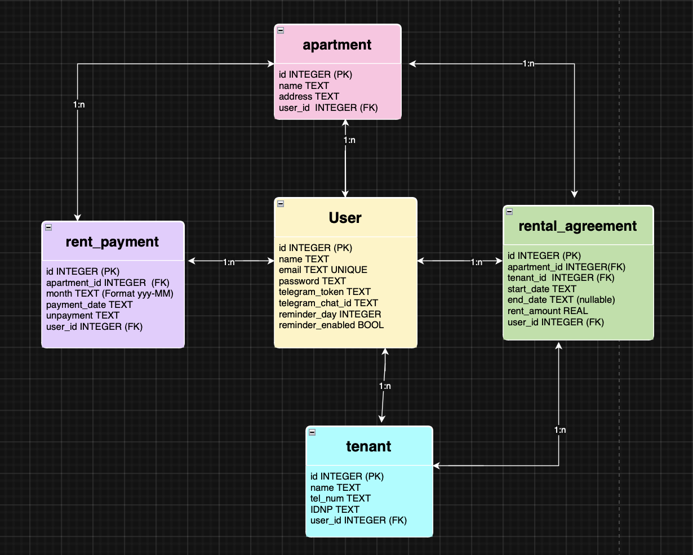

{: .label }
[Caren Kedis]

{: .no_toc }
# Data model

Our data model is designed to capture all the important information for managing rental properties, tenants, rental agreements, and payments. The following diagram shows the relationships between our main entities:

- **User:** Represents the owner/manager of the rental properties.
- **Apartment:** Contains details of individual apartments including address and association to a user.
- **Tenant:** Stores tenant information such as name, contact, and identifiers.
- **Rental Agreement:** Connects an apartment with a tenant, and defines the rental period and rent amount.
- **Rent Payment:** Logs payments made towards rental agreements.

Below is a visual overview of the data model:

{: .text-delta }

Table of contents

+ ToC
{: toc }

