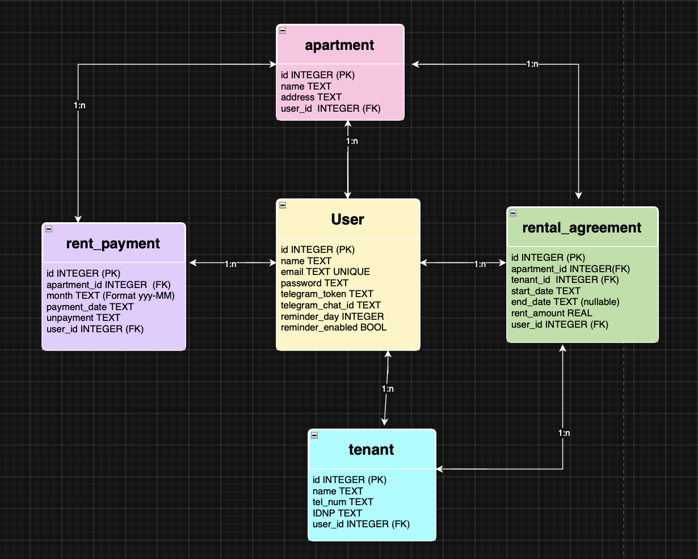

{: .label }
[Caren Kedis

{: .text-delta }

Table of contents

+ ToC
{: toc }

## Data model

Our data model is designed to capture all the important information for managing rental properties, tenants, rental agreements, and payments. The following diagram shows the relationships between our main entities:

- **User:** Represents the owner/manager of the rental properties.
- **Apartment:** Contains details of individual apartments including address and association to a user.
- **Tenant:** Stores tenant information such as name, contact, and identifiers.
- **Rental Agreement:** Connects an apartment with a tenant, and defines the rental period and rent amount.
- **Rent Payment:** Logs payments made towards rental agreements.

Below is a visual overview of the data model:

---

### User

| Field         | Type     | Description                    |
|---------------|----------|--------------------------------|
| `id`          | Integer  | Primary key                    
| `name`       | String   |   Name of the user (landlord currently)           ||
| `email`       | String   | Unique email address           |
| `password`    | String   | Hashed password                |
| `telegram_token`       | String   | Optional telegram token when enabling reminders         |
| `telegram_id` | String   | Optional Telegram chat ID      |
| `reminder_day`       | String   |  Optional Day of the month when reminders should be sent           |

---

### Apartment

| Field         | Type     | Description                          |
|---------------|----------|--------------------------------------|
| `id`          | Integer  | Primary key                          |
| `user_id`     | Integer  | Foreign key → `User.id`             |
| `name`        | String   | Internal apartment label             |
| `address`     | String   | Full address                         |

---

### Tenant

| Field        | Type     | Description                    |
|--------------|----------|--------------------------------|
| `id`         | Integer  | Primary key                    |
| `name`  | String   | Tenant's full name             |
| `IDNP`       | String   | Optional personal identity number of the tenant           |
| `phone`      | String   | Optional phone number          |
| `email`      | String   | Optional email address         |
| `user_id`     | Integer  | Foreign key → `User.id`             |

---

### RentalAgreement

| Field          | Type     | Description                                |
|----------------|----------|--------------------------------------------|
| `id`           | Integer  | Primary key                                |
| `apartment_id` | Integer  | Foreign key → `Apartment.id`              |
| `tenant_id`    | Integer  | Foreign key → `Tenant.id`                 |
| `start_date`   | Date     | Start of rental period                     |
| `end_date`     | Date     | End of rental period                       |
| `monthly_rent` | Float    | Rent amount per month                      |
| `user_id`     | Integer  | Foreign key → `User.id`             |

---

### RentPayment

| Field              | Type     | Description                                       |
|--------------------|----------|---------------------------------------------------|
| `id`               | Integer  | Primary key                                       |
| `apartment_id` | Integer  | Foreign key → `Apartment.id`              |
| `month`            | Integer  | Numeric month (1-12)                              |
| `payment_date`     | Date     | Optional actual payment date                      |
| `user_id`     | Integer  | Foreign key → `User.id`             |

---

## Relationships & Logic Enforcement

- A **User** owns many **Apartments**.
- An **Apartment** can have multiple **RentalAgreements** over time (but not overlapping).
- A **Tenant** can be linked to multiple agreements (e.g., repeat renters).
- A **RentalAgreement** generates **RentPayments** for each full month between `start_date` and `end_date`.
- **Foreign keys** enforce cascading behavior where applicable.

---

## Validation & Constraints

| Constraint | Description |
|-----------|-------------|
| **Email uniqueness** | User email must be unique in the system. |
| **Telegram ID uniqueness** | One user per Telegram chat ID (optional but enforced). |
| **Apartment–User relationship** | Each apartment is strictly owned by one user. |
| **Agreement overlap** | No two rental agreements for the same apartment may overlap in time. |
| **RentPayment uniqueness** | Only one payment record per (rental agreement, month, year). |
| **Non-null required fields** | All primary fields (e.g., names, IDs, dates) are required. |
| **Date logic** | `end_date` must be after `start_date` for agreements. |

---

This data model keeps the logic lean, extensible, and focused on monthly rental workflows - without overengineering it like a commercial property platform.