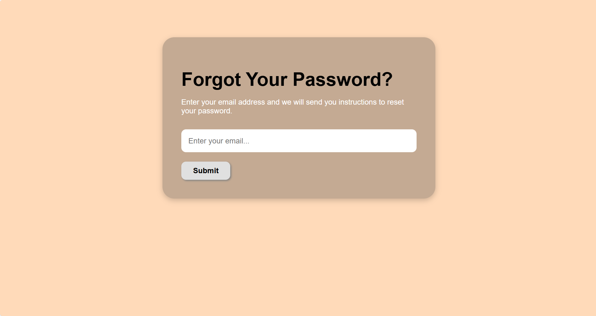
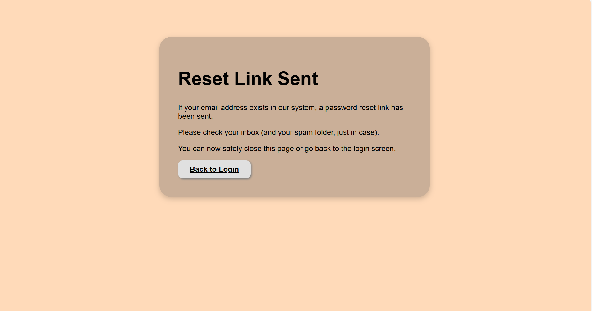

{: .label }
Denis Cercasin

{: .no_toc }
# Reference documentation

<details open markdown="block">
{: .text-delta }
<summary>Table of contents</summary>
+ ToC
{: toc }
</details>

## App Root & Utilities

### `index()`

**Route:** `/`  
**Methods:** `GET`

**Purpose:**  
Displays the landing page (`auth/landing_page.html`) as the entry point for non-authenticated users.

**Sample output:**  
Renders the public-facing landing page.
.png)

---

### `logout_confirmation()`

**Route:** `/logout_confirmation`  
**Methods:** `GET`, `POST`

**Purpose:**  
- `GET`: Renders a confirmation screen asking the user if they really want to log out.  
- `POST`: Logs out the user and redirects to the landing page.

**Sample output:**  
Renders `auth/logout_confirmation.html` or redirects to `/`.
.png)

---

### `run_insert_sample()`

**Route:** `/insert/sample`  
**Methods:** `GET`

**Purpose:**  
Flushes the database and inserts a sample dataset (for development/demo purposes only).

**Sample output:**  
Returns plain text: `Database flushed and populated with more sample data`


---

## Password Reset

### `reset_request()`

**Route:** `/reset_password`  
**Methods:** `GET`, `POST`

**Purpose:**  
- `GET`: Renders a form to input the email for password reset.  
- `POST`: Sends a secure password reset link to the given email using SendGrid if the user exists.

**Sample output:**  
Renders `reset_password.html` or redirects to `/reset_requested`.


---

### `reset_requested()`

**Route:** `/reset_requested`  
**Methods:** `GET`

**Purpose:**  
Displays confirmation that a reset email has been sent (regardless of whether user was found, for security).

**Sample output:**  
Renders `reset_requested.html`.


---

### `reset_token(token)`

**Route:** `/reset_password/<token>`  
**Methods:** `GET`, `POST`

**Purpose:**  
- `GET`: Validates the token and renders the form to input a new password.  
- `POST`: Updates the password for the user tied to the token and redirects to login.

**Token logic:**  
Uses `itsdangerous.URLSafeTimedSerializer` with a 1-hour expiration.  
If expired or invalid, redirects to reset request page with flash message.

**Sample output:**  
Renders `reset_token.html` or redirects to `/login`.

---

### `send_reset_email(to_email, link)`

**Called internally by:** `reset_request()`  
**Purpose:**  
Sends a password reset email via SendGrid with an expiring tokenized link.  
Includes fallback logging if email fails.

**Email content:**  
- Custom subject and HTML body  
- Expiration message  
- Instruction to ignore if not requested

---

## Access Control Hook

### `require_login()`

**Hook:** `@app.before_request`

**Purpose:**  
Ensures the user is authenticated for all routes **except** explicitly whitelisted ones like:
- `auth.login`, `auth.signup`, `auth.confirm_email`, `reset_password`, etc.
- Static files and `/insert/sample`
- Telegram API: `/api/reminders/today`

If a user is not authenticated, they are redirected to the landing page (`/`).

---

## Auth

### `signup()`

**Route:** `/signup`  
**Methods:** `GET`, `POST`

**Purpose:**  
- `GET`: Displays the registration form.  
- `POST`: Registers a new user if the form is valid and the email doesn't already exist.  
Instead of logging the user in immediately, a confirmation email is sent with a secure token.

**Email confirmation logic:**  
- Uses `itsdangerous.URLSafeTimedSerializer` to generate a token with a 24h expiry.  
- Sends confirmation email using SendGrid.

**Sample output:**  
Renders `signup.html` on GET; redirects to `/signup_requested` after successful form submission.
.png)


---

### `signup_requested()`

**Route:** `/signup_requested`  
**Methods:** `GET`

**Purpose:**  
Displays a success screen that instructs the user to check their inbox for a confirmation email.

**Sample output:**  
Renders `signup_requested.html`.
.png)

---

### `login()`

**Route:** `/login`  
**Methods:** `GET`, `POST`

**Purpose:**  
- `GET`: Displays login form.  
- `POST`: Authenticates the user if credentials are valid **and** email is confirmed.  
Unconfirmed users are shown a flash message to confirm their email first.

**Sample output:**  
Renders `login.html`; redirects to `/dashboard` on successful login.
.png)

---

### `confirm_email(token)`

**Route:** `/confirm/<token>`  
**Methods:** `GET`

**Purpose:**  
Validates the email confirmation token and activates the user account if valid.  
- Logs the user in automatically  
- Handles expired or invalid tokens gracefully with user feedback

**Sample output:**  
Redirects to `/dashboard?show_guide=true` with flash message after confirmation.

---

### `send_confirmation_email(to_email, link)`

**Called internally by:** `signup()`  
**Purpose:**  
Sends an HTML email via SendGrid with a secure confirmation link that expires in 24h.  
- Handles fallbacks if email sending fails  
- The email content includes branding and a fallback message

---

## Apartments (CRUD Functionality)

### `list_apartments()`

**Route:** `/apartments`  
**Methods:** `GET`, `POST`

**Purpose:**  
Displays a list of all apartments belonging to the logged-in user.  
Redirects to the apartment creation screen when the user clicks the "Add Apartment" button (POST request).

**Sample output:**  
Renders `apartments/apartments.html` template with a table of apartments.
.png)

---

### `create_apartment()`

**Route:** `/apartments/create`  
**Methods:** `GET`, `POST`

**Purpose:**  
- `GET`: Displays a form to add a new apartment.  
- `POST`: Saves the new apartment (name and address) to the database and redirects to the apartment list.

**Sample output:**  
Renders `create_apartment.html` on GET; redirects with flash message on POST.
.png)

---

### `edit_apartment(id)`

**Route:** `/apartments/edit/<int:id>`  
**Methods:** `GET`, `POST`

**Purpose:**  
- `GET`: Displays the edit form pre-filled with the apartment’s current data.  
- `POST`: Updates the apartment record in the database for the logged-in user.

**Sample output:**  
Renders `edit_apartment.html` with current apartment data; on success, redirects with flash message.
.png)

---

### `delete_apartment(id)`

**Route:** `/apartments/delete/<int:id>`  
**Methods:** `GET`, `POST`

**Purpose:**  
- `GET`: Displays a confirmation form to delete the apartment.  
- `POST`: Deletes the apartment from the database after user confirmation.

**Sample output:**  
Renders `delete_apartment.html` with a WTForm and apartment info; on success, redirects with flash message.
.png)

---

## Tenants (CRUD Functionality + Document Uploading/View)

### `list_tenants()`

**Route:** `/tenants`  
**Methods:** `GET`, `POST`

**Purpose:**  
Displays a list of all tenants belonging to the logged-in user.  
Redirects to the tenant creation form when the "Add Tenant" button is clicked (POST request).

**Sample output:**  
Renders `tenants/tenants.html` with a table of tenants.
.png)

---

### `create_tenant()`

**Route:** `/tenant/create`  
**Methods:** `GET`, `POST`

**Purpose:**  
- `GET`: Renders a form to add a new tenant, optionally with an uploaded document.  
- `POST`: Saves tenant information and the uploaded file (if any) to the database.

**Sample output:**  
Renders `create_tenant.html` on GET; redirects with flash message on POST.
.png)

---

### `edit_tenant(id)`

**Route:** `/tenant/edit/<int:id>`  
**Methods:** `GET`, `POST`

**Purpose:**  
- `GET`: Displays a form pre-filled with the tenant’s existing data.  
- `POST`: Updates tenant data and replaces the document file if a new one is uploaded.

**Sample output:**  
Renders `edit_tenant.html`; redirects with flash message on update.
.png)

---

### `delete_tenant(id)`

**Route:** `/tenant/delete/<int:id>`  
**Methods:** `GET`, `POST`

**Purpose:**  
- `GET`: Displays a confirmation form to delete a tenant.  
- `POST`: Deletes the tenant record from the database after confirmation.

**Sample output:**  
Renders `delete_tenant.html`; redirects on success with flash message.
.png)

---

### `download_document(filename)`

**Route:** `/tenant/download/<filename>`  
**Methods:** `GET`

**Purpose:**  
Downloads a previously uploaded document (e.g., ID or contract) belonging to one of the user’s tenants.

**Sample output:**  
Triggers file download via `send_from_directory`.

---

### `view_document(filename)`

**Route:** `/tenant/view/<filename>`  
**Methods:** `GET`

**Purpose:**  
Displays the uploaded document in the browser (e.g., PDF or image) without forcing download.

**Sample output:**  
Opens the document directly in the browser using `send_from_directory`.

---

## Rent Payments (CRUD Functionality)

### `list_rent_payments()`

**Route:** `/rent_payments`  
**Methods:** `GET`, `POST`

**Purpose:**  
Displays a list of all rent payments for the logged-in user.  
Supports filtering by apartment, tenant, and month via query parameters.  
Redirects to the creation form on POST request.

**Sample output:**  
Renders `rent_payments/rent_payments.html` with payment entries and filter dropdowns.
.png)

---

### `create_rent_payment()`

**Route:** `/rent_payments/create`  
**Methods:** `GET`, `POST`

**Purpose:**  
- `GET`: Displays a form to create rent payments for selected apartments and months.  
- `POST`: Inserts new rent payment records into the database, skipping duplicates.

**Sample output:**  
Renders `create_rent_payment.html` on GET; redirects with flash messages on POST indicating success or duplicates.
.png)

---

### `edit_rent_payment(id)`

**Route:** `/rent_payments/edit/<int:id>`  
**Methods:** `GET`, `POST`

**Purpose:**  
- `GET`: Loads a rent payment and shows a form to edit the month.  
- `POST`: Updates the payment month, with a duplicate check to prevent overlapping entries.

**Sample output:**  
Renders `edit_rent_payment.html` with prefilled data; redirects with flash message on success or validation warning.

---

### `delete_rent_payment(id)`

**Route:** `/rent_payments/delete/<int:id>`  
**Methods:** `GET`, `POST`

**Purpose:**  
- `GET`: Displays confirmation page with payment details (apartment, tenant).  
- `POST`: Deletes the rent payment after confirmation.

**Sample output:**  
Renders `delete_rent_payment.html`; on confirmation, redirects with a flash message.

---

## Rental Agreements (CRUD Functionality)

### `list_rental_agreements()`

**Route:** `/rental_agreements`  
**Methods:** `GET`, `POST`

**Purpose:**  
Displays all rental agreements belonging to the logged-in user, including apartment and tenant names.  
Redirects to the creation form on POST.

**Sample output:**  
Renders `rental_agreements/rental_agreements.html` with a table of agreements.
.png)

---

### `create_rental_agreement()`

**Route:** `/rental_agreements/create`  
**Methods:** `GET`, `POST`

**Purpose:**  
- `GET`: Displays a form to create a new rental agreement. Only apartments with no active agreement (`end_date IS NULL`) are selectable.  
- `POST`: Saves the new agreement with start/end dates, tenant, and rent amount.

**Sample output:**  
Renders `create_rental_agreement.html`; redirects with a success message on POST.
.png)

---

### `edit_rental_agreement(id)`

**Route:** `/rental_agreements/edit/<int:id>`  
**Methods:** `GET`, `POST`

**Purpose:**  
- `GET`: Loads the rental agreement for editing and shows dropdowns for available tenants.  
- `POST`: Updates the agreement details (dates, tenant, rent amount) in the database.

**Sample output:**  
Renders `edit_rental_agreement.html`; redirects with a flash message on success.

---

### `delete_rental_agreement(id)`

**Route:** `/rental_agreements/delete/<int:id>`  
**Methods:** `GET`, `POST`

**Purpose:**  
- `GET`: Shows a confirmation page with apartment and tenant information.  
- `POST`: Deletes the rental agreement after user confirmation.

**Sample output:**  
Renders `delete_rental_agreement.html`; redirects with a flash message after deletion.
.png)

---

## Dashboard

### `index()`

**Route:** `/dashboard`  
**Methods:** `GET`, `POST`

**Purpose:**  
Displays the dashboard view for the logged-in user with key rental insights and financial projections.

The dashboard dynamically adjusts its content based on user status:

- **New Users:**  
  If the user has no apartments or active agreements, a simplified view is rendered with welcome messages and prompts to add properties and tenants.

- **Active Users:**  
  Displays full dashboard with:
  - List of unpaid or upcoming rent obligations (up to 1 month ahead)
  - Cashflow projections (expected vs. collected income over 6 months)
  - Total number of apartments
  - Number of active rental agreements

Includes helper logic:
- `get_upcoming_unpaid_rents()` checks for due rents in the past/current/next month.
- `format_amount()` ensures currency formatting (e.g. 100.00 → 100).

**Sample output:**  
Renders `dashboard/dashboard.html` with variables:
- `projection`: list of months with expected/collected/missing rent  
- `total_apartments`: count  
- `active_agreements`: count  
- `upcoming_unpaid`: list of unpaid months per tenant

.png)
.png)
.png)

---

## Settings

### `settings()`

**Route:** `/settings`  
**Methods:** `GET`, `POST`  

**Purpose:**  
Displays the current user's notification settings, including:
- Day of the month to send reminders
- Whether reminders are enabled
- Whether to use Telegram and/or Email

Also shows a confirmation alert if `?settings_saved=true` is passed.

**Sample output:**  
Renders `settings/settings.html` with settings pre-filled.
.png)
.png)

---

### `update_reminder_settings()`

**Route:** `/settings/update_reminders`  
**Methods:** `POST`  

**Purpose:**  
Saves the user’s updated reminder settings to the database, including:
- Preferred reminder day
- Whether reminders are enabled
- Channel preferences (Telegram and/or Email)

Redirects back to `/settings?settings_saved=true` on success.

**Sample output:**  
No render; redirects with flash query string.

---

### `connect_telegram()`

**Route:** `/connect_telegram`  
**Methods:** `GET`  

**Purpose:**  
Generates a **one-time-use Telegram connection link** with a unique UUID token.  
Stores the token in the user’s record and constructs a personalized `t.me` deep link for Telegram bot onboarding.

**Bot name:** `@RentTracker_bot`  
**Example link generated:**  
`https://t.me/RentTracker_bot?start=some-uuid-token`

**Sample output:**  
Renders `connect_telegram.html` with a Telegram button/link.

---

## API

### `get_reminders_for_telegram_bot()`

**Route:** `/api/reminders/today`  
**Methods:** `GET`  
**Authentication:** Token-based (via `telegram_token` in query string)  
**Access Control:** Public (used by Telegram bot with UUID token)

**Purpose:**  
Returns a list of upcoming unpaid rent reminders for a specific user, identified by their one-time-use Telegram token.

Used by the Rent Tracker Telegram Bot (`@RentTracker_bot`) to deliver personalized reminder messages via chat.

**Query Parameters:**
- `token` (required): a UUID token stored in the user's database record

**Response Format:** `application/json`

**Success (200):**
```json
{
  "status": "success",
  "reminder_count": 2,
  "data": [
    {
      "apartment_name": "Greenview A1",
      "tenant_name": "Elena Popescu",
      "months": ["2025-06", "2025-07"],
      "monthly_rent": 500.0,
      "month_count": 2,
      "total_due": 1000.0
    },
    {
      "apartment_name": "Sunset Loft",
      "tenant_name": "Ivan Bondar",
      "months": ["2025-07"],
      "monthly_rent": 700.0,
      "month_count": 1,
      "total_due": 700.0
    }
  ]
}
```

**Error (401):**
```json
{
  "status": "error",
  "message": "Missing token"
}
```

**Error (403):**
```json
{
  "status": "error",
  "message": "Invalid token"
}
```

**Notes**

- Months are returned in YYYY-MM format.
- total_due is calculated as monthly_rent × month_count.
- This endpoint is read-only and stateless.


{: .fs-2 }
Last build: {{ site.time | date: '%d %b %Y, %R%:z' }}